# 🚀 Procurement Copilot
### Enterprise Procurement Analytics Platform | SQL • PySpark • Power BI • React • AI

<p align="center">


</p>

---

# 🌐 Live Demo

### 🔗 Website
procurementcopilot.vercel.app

### 💻 GitHub Repository
https://github.com/hrishik2907

---

# 📌 Project Overview

Procurement Copilot is an enterprise procurement analytics platform that demonstrates the complete analytics lifecycle—from raw business data to executive decision making.

Unlike a traditional dashboard project, this application simulates how modern organizations interact with procurement data through an integrated analytics workspace combining:

- SQL data preparation
- PySpark ETL pipelines
- Power BI executive dashboards
- AI-powered business explanations
- Interactive React application

The goal of this project is to showcase how business intelligence, data engineering, and AI can work together inside one enterprise platform.

---

# 📢 Demo Notice

This project is built as a portfolio demonstration.

The procurement dataset is a sample enterprise procurement dataset used for demonstration purposes.

The **Power BI dashboards were personally designed and developed by me** to showcase enterprise reporting, KPI design, procurement analytics, and business intelligence best practices.

The React website acts as an enterprise analytics portal that integrates those dashboards together with AI-powered insights.

---

# 💡 What This Platform Does

Instead of simply displaying dashboards, Procurement Copilot simulates how an enterprise analytics application works.

A recruiter can experience the complete analytics workflow from importing data to receiving AI-driven recommendations.

---

# ⚙️ How the Platform Works

## Step 1 — Enterprise Dataset

The application starts with an enterprise procurement dataset containing:

- Procurement transactions
- Vendors
- Purchase Orders
- Invoices
- Payments
- Contracts
- Budgets
- Supplier Risks

For demonstration purposes, the dataset is already connected so recruiters can immediately explore the platform.

---

## Step 2 — Analytics Generation

Once the dataset is available, the platform automatically provides:

- Executive KPIs
- Procurement metrics
- Supplier analytics
- Budget utilization
- Contract analysis
- Spend trends
- Risk monitoring

Instead of manually analyzing spreadsheets, users immediately receive an executive analytics experience.

---

## Step 3 — Interactive Power BI Dashboards

The website embeds enterprise Power BI dashboards built specifically for this project.

The dashboards include:

- Executive Overview
- Procurement Analytics
- Vendor Analysis
- Spend Trends
- Category Analysis
- Supplier Risk
- Budget Utilization

These dashboards demonstrate how business intelligence can be embedded inside enterprise software.

---

## Step 4 — Jarvis AI Analyst

The platform includes an AI assistant named **Jarvis**.

Rather than simply showing charts, Jarvis explains business problems in plain English.

Users can ask questions like:

- Why did procurement spend increase?
- Which suppliers require attention?
- Which departments exceeded budget?
- What risks should executives prioritize?
- What actions should reduce procurement cost?

This demonstrates how AI can transform dashboards into decision-support systems.

---

## Step 5 — Procurement Workspace

The application also visualizes the complete Procure-to-Pay process.

- Vendor Management
- Purchase Requisition
- Purchase Orders
- Goods Receipt
- Invoice Matching
- Payments
- Risk Monitoring
- Executive Reporting

This helps users understand where analytics fits within procurement operations.

---

# 🛠 Technology Stack

| Layer | Technology |
|---------|------------|
| Frontend | React + TypeScript |
| Styling | Tailwind CSS |
| ETL | PySpark |
| Data Cleaning | SQL |
| Data Modeling | Power Query |
| Semantic Model | DAX |
| Visualization | Power BI |
| AI Layer | Jarvis AI Analyst |
| Deployment | Vercel |
| Version Control | GitHub |

---

# 🏗 Architecture

```
Enterprise Dataset
        │
        ▼
SQL Cleaning
        │
        ▼
PySpark ETL
        │
        ▼
Power Query
        │
        ▼
Power BI Semantic Model
        │
        ▼
Executive Dashboards
        │
        ▼
React Analytics Platform
        │
        ▼
Jarvis AI Analyst
```

---

# ✨ Key Features

✔ Enterprise Procurement Dashboard

✔ Executive KPI Reporting

✔ AI Procurement Analyst

✔ Supplier Risk Center

✔ Procurement Workspace

✔ Executive Report Generator

✔ Dataset Explorer

✔ Interactive Power BI Integration

✔ Business Process Visualization

✔ Responsive Enterprise UI

---

# 📷 Application Screenshots

## 🏠 Home

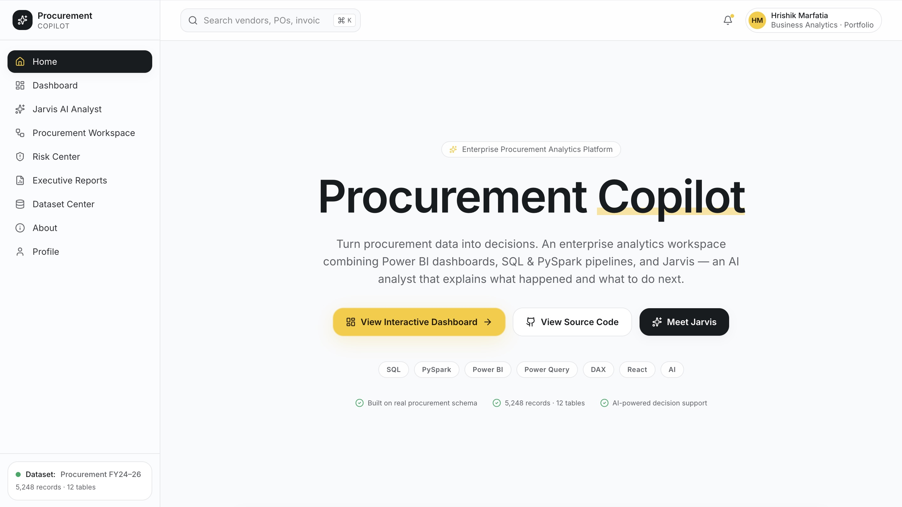

---

## 📊 Analytics Dashboard

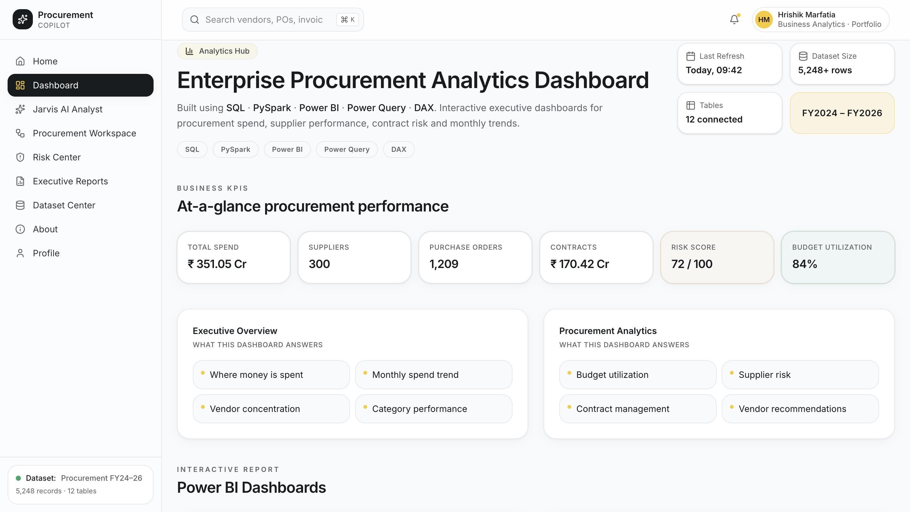

---

## 📈 Executive Overview Dashboard

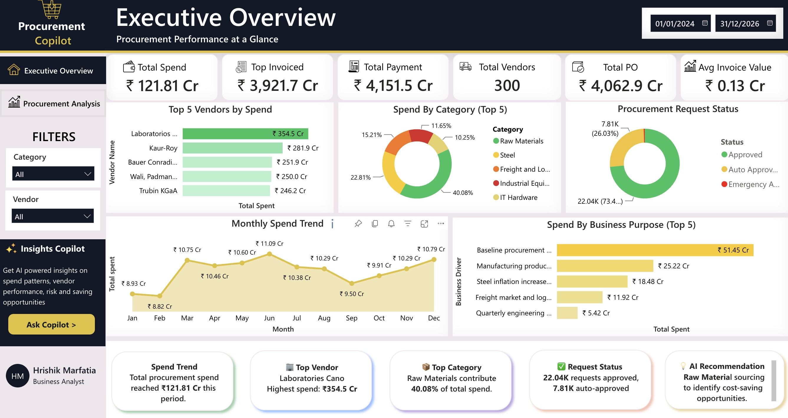

---

## 📉 Procurement Analytics Dashboard

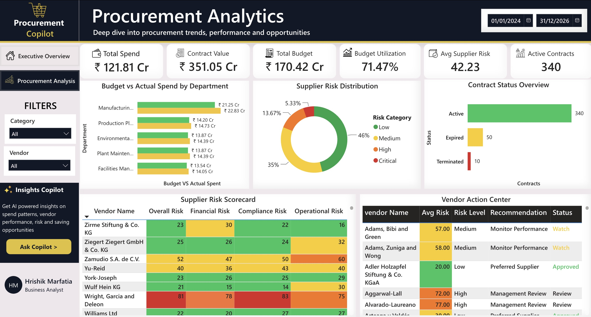

---

## 🤖 Jarvis AI Analyst

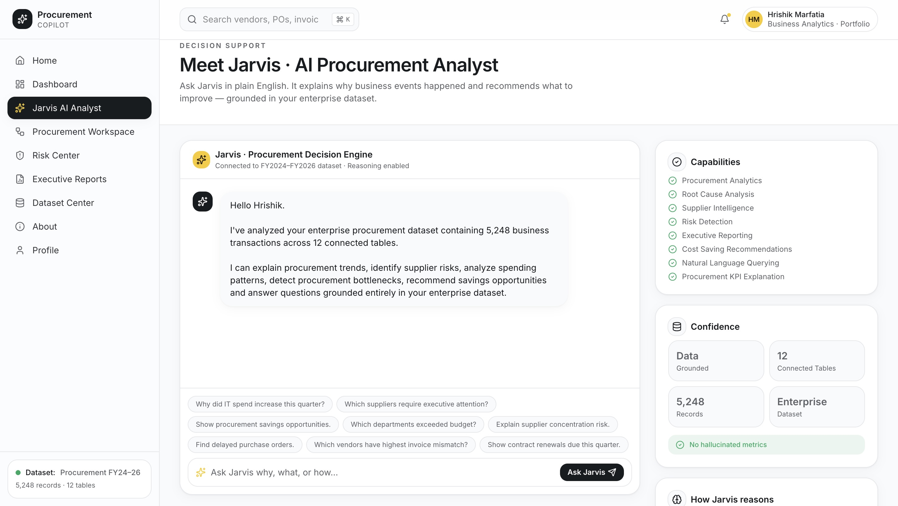

---

## 🏢 Procurement Workspace

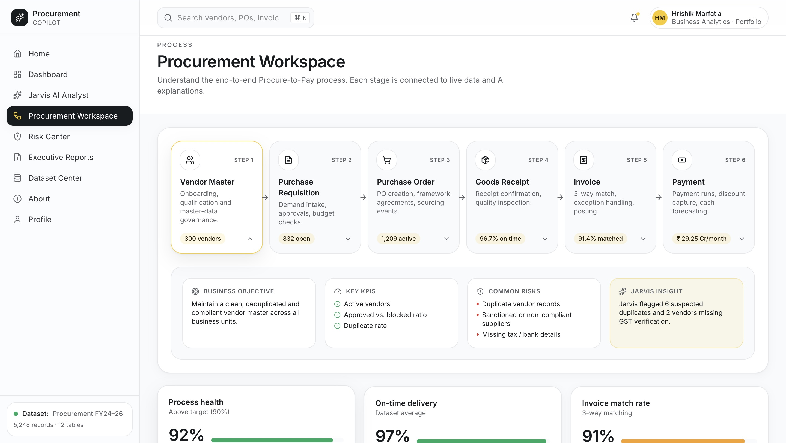

---

## ⚠ Risk Center

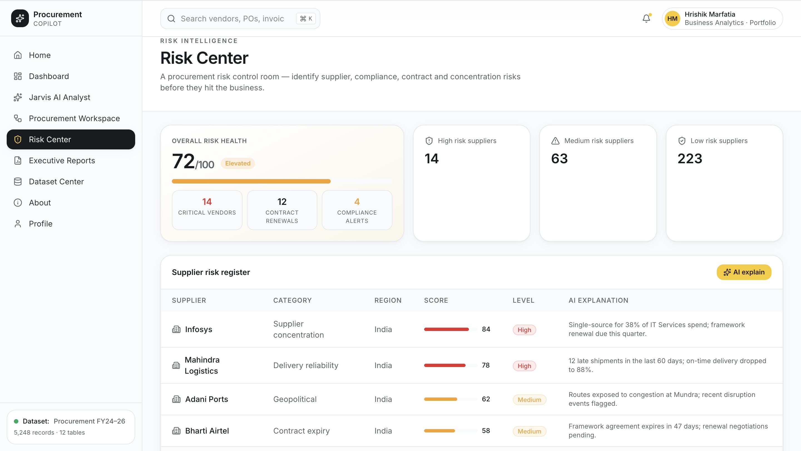

---

## 📄 Executive Reports

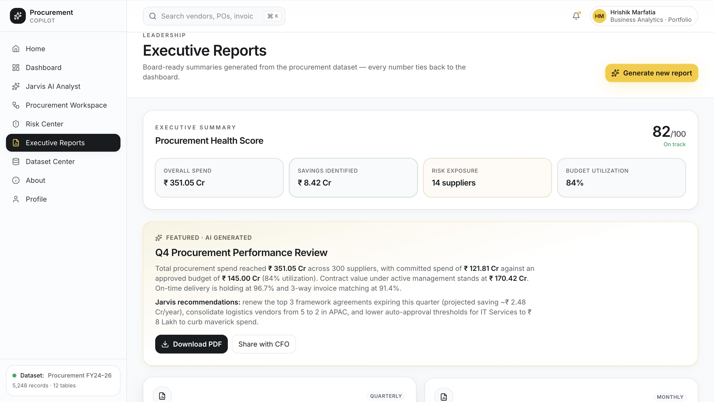

---

## 🗄 Dataset Explorer

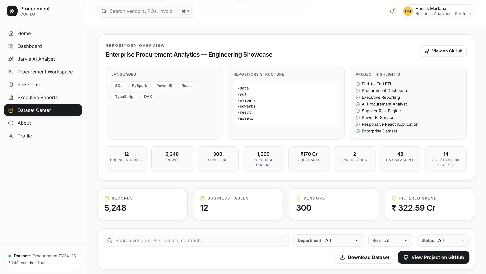

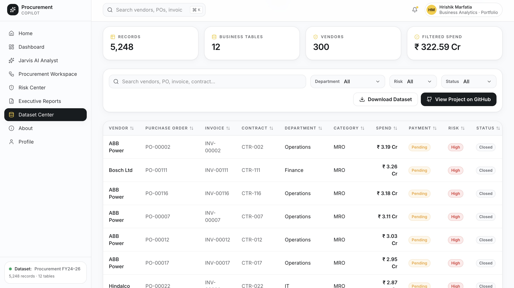

---

## ℹ About

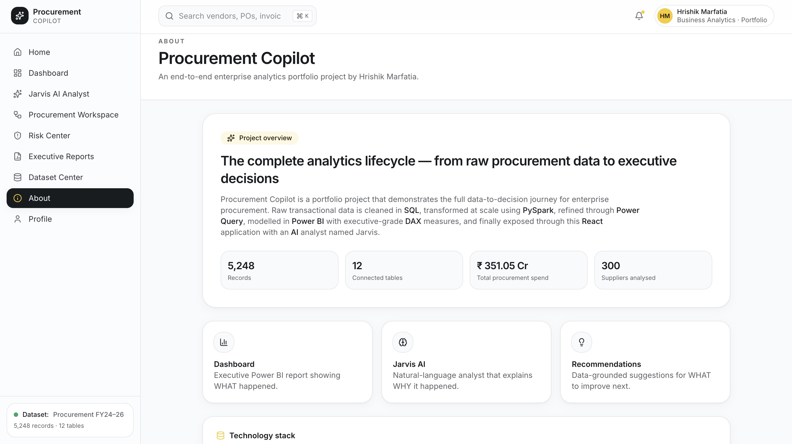

---

## 👤 Profile

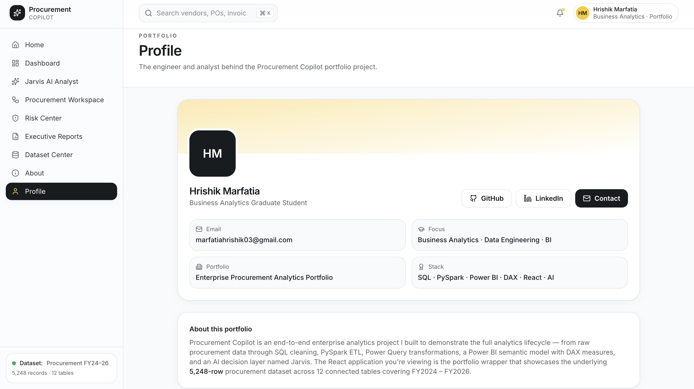

---

# 📂 Project Structure

```
procurementcopilot/

│

├── Assets/
│ ├── Screenshots
│

├── src/
│ ├── Components
│ ├── Pages
│ ├── Hooks
│ ├── Data
│

├── public/

├── package.json

├── vite.config.ts

└── README.md
```

---

# 📊 Business Analytics Covered

This project demonstrates:

- Executive Reporting
- Procurement Analytics
- Vendor Performance Analysis
- Budget Tracking
- Category Spend Analysis
- Supplier Risk Management
- Procurement KPI Design
- Business Intelligence
- Data Storytelling

---

# 💻 Technical Skills Demonstrated

### Data Engineering

- SQL
- PySpark
- ETL Pipelines
- Data Cleaning
- Data Transformation

### Business Intelligence

- Power BI
- Power Query
- DAX
- KPI Design
- Dashboard Development

### Frontend

- React
- TypeScript
- Tailwind CSS

### Analytics

- Procurement Analytics
- Executive Reporting
- Business Insights
- Data Visualization

---

# 🚀 Future Improvements

- Live database integration
- Authentication
- User roles
- AI-powered report generation
- Predictive procurement forecasting
- Supplier recommendation engine
- Real-time Power BI embedding
- Cloud database support

---

# 👨‍💻 Author

## Hrishik Marfatia

Business Analytics Graduate Student

University of New Haven

### GitHub

https://github.com/hrishik2907

### LinkedIn

https://www.linkedin.com/in/hrishik-marfatia-199059233/

---

# ⭐ If you enjoyed this project

Please consider giving this repository a ⭐.

It helps recruiters and visitors discover the project.

---

## Thank you for visiting Procurement Copilot!
